<div align="center">

# 🔊 VOIDA

</div>

**청각장애인과 비장애인이 실시간으로 소통**할 수 있는 커뮤니케이션 서비스<br>
**입술 움직임을 인식해 음성으로 변환**하는 기술과 **STT(Speech-To-Text)를 통해 텍스트를 제공**하는 기능을 함께 활용하여, 누구나 쉽게 참여할 수 있는 실시간 대화 플랫폼을 제공합니다.

> 목소리가 보이다, 이곳에서 모이다, **VOIDA**

- **개발 기간** : 2025.07.07 ~ 2025.08.22 **(7주)**
- **플랫폼** : Web & Desktop App
- **개발 인원** : 6명 <br><br>


</div> <br>

## 🔎 목차

<div align="center">

### <a href="#developers">🌟 팀원 구성</a>

### <a href="#resources">🔽 설치 파일 및 모델 리소스</a>

### <a href="#techStack">🛠️ 기술 스택</a>

### <a href="#systemArchitecture">🌐 시스템 아키텍처</a>

### <a href="#skills">📲 기능 구성</a>

### <a href="#directories">📂 디렉터리 구조</a>

### <a href="#projectDeliverables">📦 프로젝트 산출물</a>

</div>
<br>

## 🌟 팀원 구성

<a name="developers"></a>

<div align="center">

<div align="center">
<table>
    <tr>
        <td width="33%" align="center"> <a href="https://github.com/gyudol">
             <br> 🍖 김규찬 <br>(Backend & DevOps) </a> <br></td>
        <td width="33%" align="center"> <a href="https://github.com/01seok">
             <br> 🏋️‍♀️ 이석재 <br>(Backend & Leader) </a> <br></td>
        <td width="33%" align="center"> <a href="https://github.com/0w0n2">
             <br> 👻 이혜원 <br>(Backend) </a> <br></td>
    </tr>
    <tr>
      <td width="280px">
        <sub>
          - 인프라 및 CI/CD 파이프라인 구축·운영 <br>
          - Spring: OpenVidu 세션 / Release API 구현 <br>
          - FastAPI 기반 Webhook Handler 서버 구현 <br>
          - 협업 및 이벤트 알림 자동화 파이프라인 구축
        </sub>
      </td>
      <td width="280px">
        <sub>
          - MeetingRoom / 초대코드 API 구현 <br>
          - WebSocket / STOMP 기반 채팅 API 구현 <br>
          - Spring: AWS S3, MongoDB 연동
        </sub>
      </td>
      <td width="280px">
        <sub>
          - Security, OAuth2, SMTP 기반 인증 API 구현 <br>
          - 마이페이지 / 세션 락 API 구현 <br>
          - OpenAI 기반 STT, TTS API 구현 <br>
          - Lip Model → Runpod 마이그레이션
        </sub>
      </td>
    </tr>

</table>

<table>
    <tr>
        <td width="33%" align="center"> <a href="https://github.com/soomkim00">
         <br> 🐶 김수민 <br>(Backend & AI) </a> <br></td>
        <td width="33%" align="center"> <a href="https://github.com/minhe8564">
         <br> 🍔 이민희 <br>(Frontend) </a> <br></td>
        <td width="33%" align="center"> <a href="https://github.com/OPENARMS1027">
         <br> 🍥 이진모 <br>(Frontend) </a> <br></td>
    </tr>
    <tr>
        <td width="280px">
          <sub>
            - Lip Reading 모델 학습 및 최적화 <br>
            - 구화 인식 / 번역 / TTS 파이프라인 구축 <br>
            - FastAPI 기반 Lip Model 서버 구현
          </sub>
        </td>
        <td width="280px">
          <sub>
            - OpenVidu 음성 연결, Signaling 채팅 구현 <br>
            - STT / Lip Reading 결과 음성 세션 연동 <br>
            - STOMP 기반 실시간 채팅방 구현 <br>
            - 튜토리얼 / 마이페이지 구현
          </sub>
        </td>
        <td width="280px">
          <sub>
            - LiveRoom 오버레이 창, 단축키 매핑 구현 <br>
            - 공식 웹 사이트 다운로드 페이지 구현 <br>
            - 로그인 / 회원가입 페이지 구현
          </sub>
        </td>
    </tr>

</table>
</div>
<br>

</div>

## 🔽 설치 파일 및 모델 리소스

<a name="resources"></a>

<div align="center">

|    **구분**    |                                                       **파일**                                                        | **용량** |                       **설명**                       |
| :------------: | :-------------------------------------------------------------------------------------------------------------------: | :------: | :--------------------------------------------------: |
| 💻 Desktop App |     [VOIDA_Setup_1.0.13.exe](https://drive.google.com/file/d/1Tv7fOcJiGAiu2GrD3XHRhlQJzizOCsKt/view?usp=sharing)      | 204.2 MB |            Windows Desktop App 설치 파일             |
|   ⚖️ Weight    |        [encoder_int8.bin](https://drive.google.com/file/d/1CvfArZwuRH_ygXReHzEzvKX348_fhLcK/view?usp=sharing)         | 178.7 MB |    인코더 가중치 <br>(`backend-lip-model/models`)    |
|   ⚖️ Weight    | [vsr_trlrs2lrs3vox2avsp_base.pth](https://drive.google.com/file/d/1ie-1ScbkZHdE7MgoQAQ7q4e-QoYoQ2ZV/view?usp=sharing) | 955.5 MB | Lip Reading 가중치 <br>(`backend-lip-model/models`)  |
|    🤖 Model    |            [model.bin](https://drive.google.com/file/d/1CZ9TxvdK6kEB5rDxIjjLCQHMuaDuVwxK/view?usp=sharing)            | 467.9 MB | 기타 모델 <br>(`backend-lip-model/models/lip-model`) |

</div><br>

## 🛠️ 기술 스택

<a name="techStack"></a>

### 🌕 Frontend

<div align="center">

<br>


<br>


<br>

|      **Category**       |                                                 **Stack**                                                  |
| :---------------------: | :--------------------------------------------------------------------------------------------------------: |
|      **Language**       |                                              TypeScript 5.8.3                                              |
| **Runtime Environment** |                                      Node.js 22.17.0, Electron 37.3.0                                      |
|      **Framework**      |                                      React 19.1.0, React Router 7.7.0                                      |
|       **Library**       | STOMP.js 7.1.1, SockJS Client 1.6.1, OpenVidu Browser 2.31.0, Zustand 5.0.6, Axios 1.10.0, Emotion 11.14.0 |
|         **IDE**         |                                         Visual Studio Code 1.103.1                                         |

</div>

### 🌑 Backend

<div align="center">


<br>


<br>


<br>


</div>

|  **Category**  |                                                                                                                                  **Stack**                                                                                                                                   |
| :------------: | :--------------------------------------------------------------------------------------------------------------------------------------------------------------------------------------------------------------------------------------------------------------------------: |
|  **Language**  |                                                                                                                                   Java 17                                                                                                                                    |
| **Framework**  |                                                                                                                              Spring Boot 3.4.5                                                                                                                               |
|  **Library**   | Spring Security, Spring Validation, Spring Data JPA, Spring Data MongoDB, Spring Data Redis, Springdoc OpenAPI 2.8.7, Spring Cloud AWS S3, Spring Security OAuth2 Client, Spring Mail, Spring WebSocket, Spring WebFlux, OpenVidu Java Client 2.31.0, Apache HttpMime 4.5.14 |
|  **Database**  |                                                                                                                   MySQL 9.3.0, MongoDB 8.0.11, Redis 7.4.5                                                                                                                   |
|    **IDE**     |                                                                                                                  IntelliJ IDEA 2025.1.3 (Ultimate Edition)                                                                                                                   |
| **Build Tool** |                                                                                                                                Gradle 8.14.3                                                                                                                                 |

### 🤖 AI

<div align="center">


<br>


<br>


<br>

<br>

|      **Category**       |                                                                                                      **Stack**                                                                                                       |
| :---------------------: | :------------------------------------------------------------------------------------------------------------------------------------------------------------------------------------------------------------------: |
|      **Language**       |                                                                                                    Python 3.9.13                                                                                                     |
| **Runtime Environment** |                                                                                      Uvicorn[standard] 0.35.0, Gunicorn 22.0.0                                                                                       |
|      **Framework**      |                                                                                                   FastAPI 0.116.1                                                                                                    |
|       **Library**       | Torch 2.8.0, Openvino-dev 2024.1.0, Ctranslate2 4.6.0, opencv-python-headless 4.9.0.80, Mediapipe 0.10.14, Sentencepiece 0.2.0, Transformers 4.45.2, Argostranslate 1.9.6, Numpy 1.26.4, Scipy 1.13.1, Openai 1.99.9 |
|         **IDE**         |                                                                                              Visual Studio Code 1.103.1                                                                                              |

</div>

### ⚙️ DevOps

<div align="center">


<br>


<br>

<br>

|    **Category**     |             **Spec**              |
| :-----------------: | :-------------------------------: |
|  **Instance Type**  |             T2.XLARGE             |
|       **CPU**       |              4 vCPUs              |
|       **RAM**       |               16 GB               |
| **Storage (Disk)**  |      SSD: 320 GB, HDD: 6 TB       |
|     **Docker**      |              v28.1.1              |
| **Docker Compose**  |              v2.38.2              |
|     **Jenkins**     |               2.520               |
|      **Nginx**      |           nginx/1.18.0            |
| **Webhook Handler** | FastAPI 0.116.1, Python 3.11-slim |

</div>

### 🤝 Collaboration

<div align="center">


</div>
<br>

## 🌐 시스템 아키텍처

<a name="systemArchitecture"></a>

### 🖧 System Architecture

<div align="center">

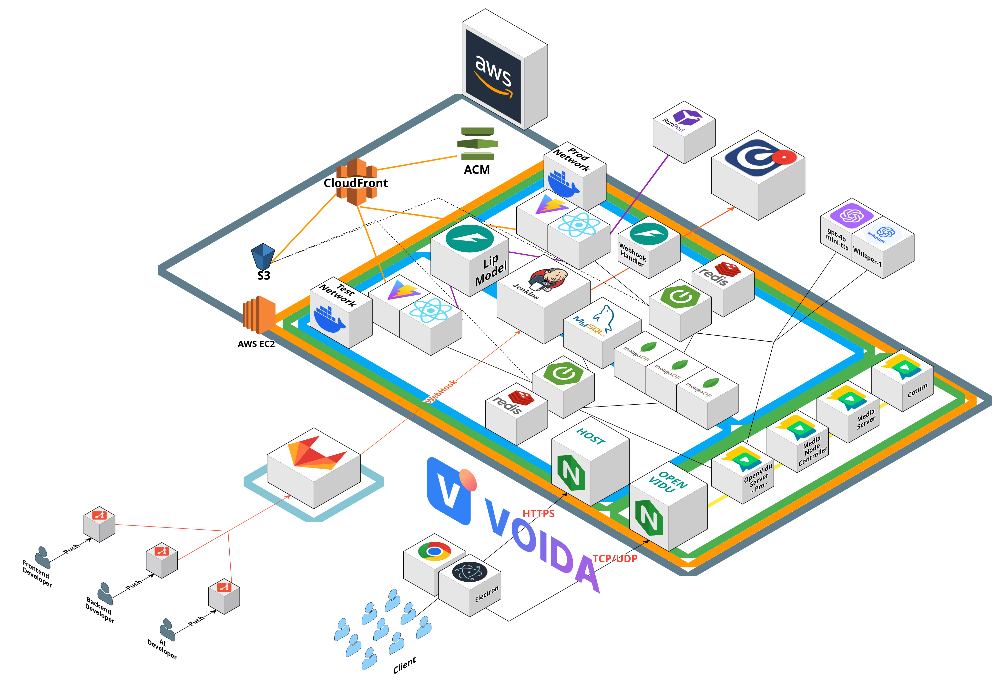
</div>

### 🚀 CI/CD Architecture

<div align="center">

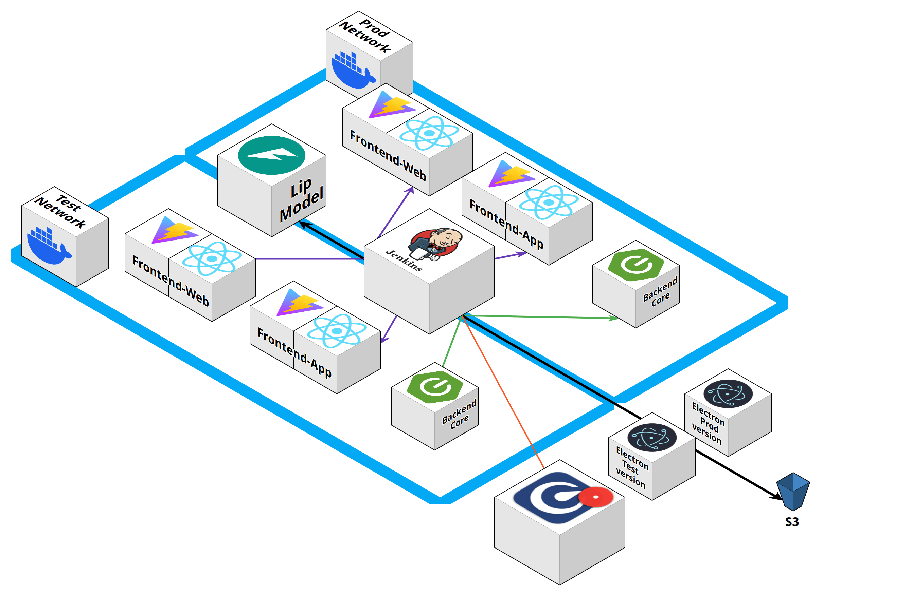
</div>

### 📢 Collaboration & Event Notification

<div align="center">

<table>
  <tr>
    <td align="center" width="50%"><b>❌ Jenkins Pipeline Failure</b></td>
    <td align="center" width="50%"><b>✅ Jenkins Pipeline Success</b></td>
  </tr>
  <tr>
    <td align="center">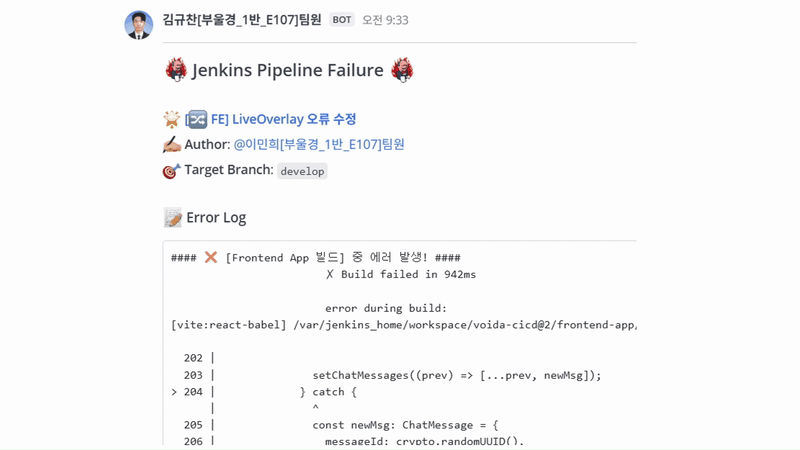</td>
    <td align="center">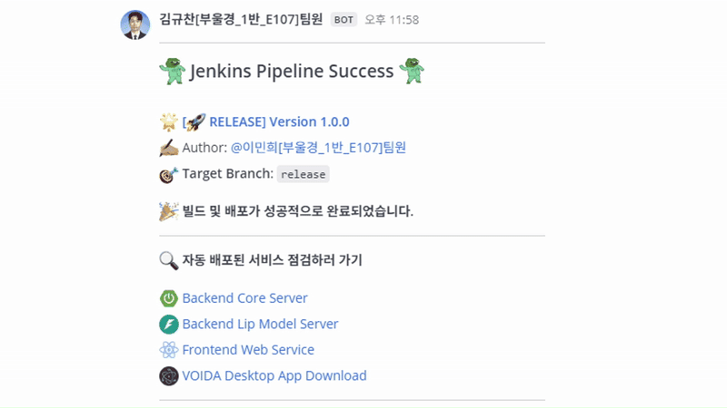</td>
  </tr>
  <tr>
    <td align="center" width="50%"><b>🗨️ Jira Issue Notification</b></td>
    <td align="center" width="50%"><b>🔀 Merge Request Created Notification</b></td>
  </tr>
  <tr>
    <td align="center"></td>
    <td align="center">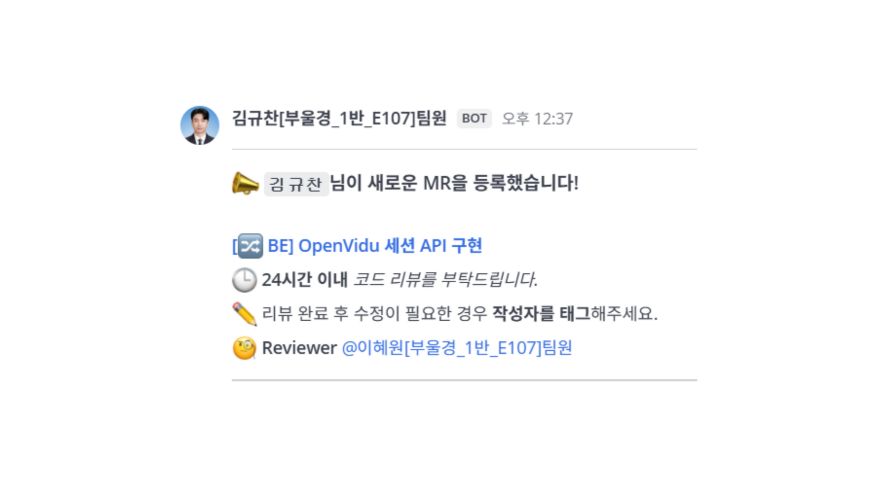</td>
  </tr>
</table>

</div>

<br>

## 📲 기능 구성

<a name="skills"></a>

<div align="center">

<table>
  <tbody align="center"> 
    <tr> <th style="text-align: center"> 데스크톱 앱 다운로드 </th> <th style="text-align: center"> 회원가입 </th> </tr>
    <tr> <td width="50%"></td> 
        <td width="50%">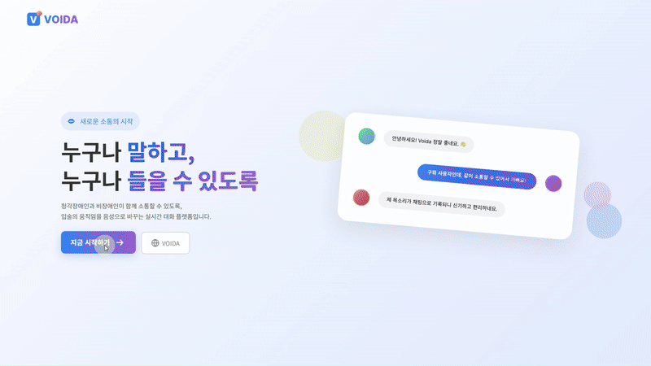</td> </tr> </tbody>
  <tbody align="center"> 
    <tr> <th style="text-align: center"> 일반 사용자 튜토리얼 </th> <th style="text-align: center"> 구화 사용자 튜토리얼 </th> </tr>
    <tr> <td width="50%">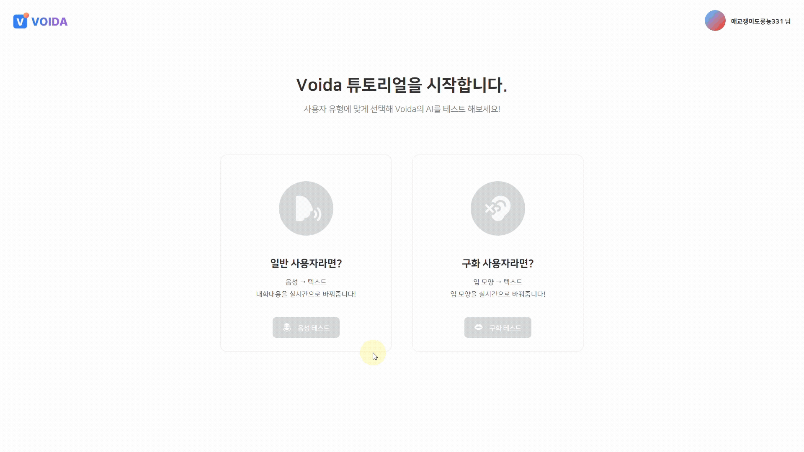</td>
    <td width="50%">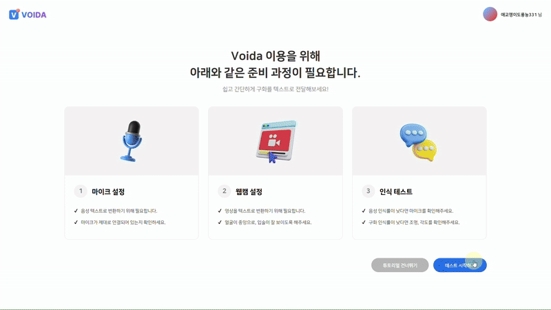</td> </tr> </tbody>
  <tbody align="center"> 
    <tr> <th style="text-align: center"> 마이페이지 </th> <th style="text-align: center"> 대기방 생성 </th> </tr>
    <tr> <td width="50%">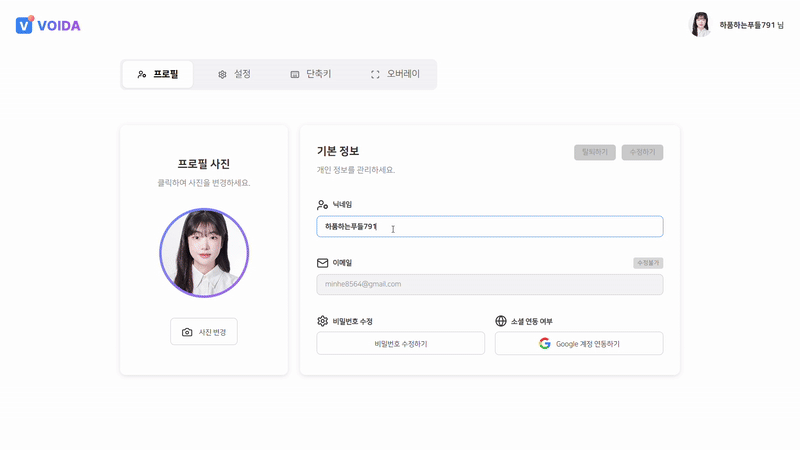</td>
    <td width="50%"></td> </tr>
  </tbody>
  <tbody align="center"> 
    <tr> <th style="text-align: center"> 대기방 접속 </th> <th style="text-align: center"> 대기방 설정 </th> </tr>
    <tr> <td width="50%"></td>
    <td width="50%"></td> </tr>
  </tbody>
  <tbody align="center"> 
    <tr> <th style="text-align: center"> 라이브 세션 (일반 사용자) </th> <th style="text-align: center"> 라이브 세션 (구화 사용자) </th> </tr>
    <tr> <td width="50%">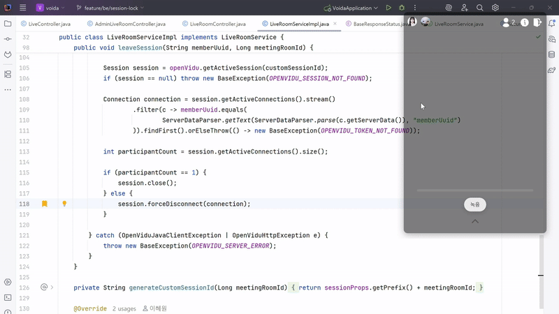</td>
    <td width="50%"></td> </tr>
  </tbody>
</table>
</div>
<br>

## 📂 디렉터리 구조

<a name="directories"></a>

### 🌕 Frontend

<details align="left">
  <summary>
    <strong>Frontend-App</strong>
  </summary>

```
📦frontend-app
 ┣ 📂electron
 ┃ ┣ 📂assets
 ┣ 📂public
 ┃ ┣ 📂fonts
 ┃ ┗ 📂logo
 ┣ 📂src
 ┃ ┣ 📂apis
 ┃ ┃ ┣ 📂auth
 ┃ ┃ ┣ 📂core
 ┃ ┃ ┣ 📂live-room
 ┃ ┃ ┣ 📂meeting-room
 ┃ ┃ ┣ 📂stomp
 ┃ ┃ ┗ 📂tutorial
 ┃ ┣ 📂assets
 ┃ ┃ ┣ 📂category
 ┃ ┃ ┣ 📂icons
 ┃ ┃ ┣ 📂images
 ┃ ┃ ┣ 📂logo
 ┃ ┃ ┣ 📂profiles
 ┃ ┃ ┗ 📂test
 ┃ ┣ 📂components
 ┃ ┃ ┣ 📂auth
 ┃ ┃ ┣ 📂common
 ┃ ┃ ┣ 📂live-room
 ┃ ┃ ┣ 📂main
 ┃ ┃ ┃ ┣ 📂modal
 ┃ ┃ ┣ 📂meeting-room
 ┃ ┃ ┃ ┣ 📂chat
 ┃ ┃ ┃ ┣ 📂members
 ┃ ┃ ┃ ┗ 📂modal
 ┃ ┃ ┃ ┃ ┣ 📂info
 ┃ ┃ ┃ ┃ ┗ 📂setting
 ┃ ┃ ┣ 📂my-page
 ┃ ┃ ┃ ┣ 📂modal
 ┃ ┃ ┃ ┗ 📂tab
 ┃ ┃ ┣ 📂tutorial
 ┃ ┃ ┃ ┣ 📂modal
 ┃ ┣ 📂hooks
 ┃ ┣ 📂pages
 ┃ ┃ ┣ 📂auth
 ┃ ┃ ┣ 📂tutorial
 ┃ ┣ 📂stores
 ┃ ┣ 📂styles
 ┃ ┣ 📂types
 ┃ ┣ 📜App.tsx
 ┃ ┣ 📜main.tsx
 ┃ ┗ 📜vite-env.d.ts
 ┣ 📜.env
 ┣ 📜.gitignore
 ┣ 📜.prettierrc
 ┣ 📜db.json
 ┣ 📜eslint.config.js
 ┣ 📜index.html
 ┣ 📜package-lock.json
 ┣ 📜package.json
 ┣ 📜README.md
 ┣ 📜tsconfig.app.json
 ┣ 📜tsconfig.json
 ┣ 📜tsconfig.node.json
 ┗ 📜vite.config.ts
```

</details>

<details align="left">
  <summary>
    <strong>Frontend-Web</strong>
  </summary>

```
📦frontend-web
 ┣ 📂dist
 ┃ ┣ 📂assets
 ┃ ┣ 📂fonts
 ┃ ┣ 📂logo
 ┣ 📂public
 ┃ ┣ 📂fonts
 ┃ ┗ 📂logo
 ┣ 📂src
 ┃ ┣ 📂assets
 ┃ ┃ ┣ 📂icons
 ┃ ┃ ┣ 📂image
 ┃ ┃ ┣ 📂logo
 ┃ ┃ ┗ 📂show
 ┃ ┣ 📂components
 ┃ ┣ 📂pages
 ┃ ┣ 📂styles
 ┣ 📜.gitignore
 ┣ 📜.prettierrc
 ┣ 📜Dockerfile
 ┣ 📜eslint.config.js
 ┣ 📜index.html
 ┣ 📜package-lock.json
 ┣ 📜package.json
 ┣ 📜README.md
 ┣ 📜tsconfig.app.json
 ┣ 📜tsconfig.json
 ┣ 📜tsconfig.node.json
 ┗ 📜vite.config.ts
```

</details>

### 🌑 Backend

<details align="left">
  <summary>
    <strong>Backend-Core</strong>
  </summary>

```
📦backend-core
 ┣ 📂gradle
 ┃ ┗ 📂wrapper
 ┣ 📂src
 ┃ ┣ 📂main
 ┃ ┃ ┣ 📂java
 ┃ ┃ ┃ ┗ 📂com
 ┃ ┃ ┃ ┃ ┗ 📂bbusyeo
 ┃ ┃ ┃ ┃ ┃ ┗ 📂voida
 ┃ ┃ ┃ ┃ ┃ ┃ ┣ 📂api
 ┃ ┃ ┃ ┃ ┃ ┃ ┃ ┣ 📂admin
 ┃ ┃ ┃ ┃ ┃ ┃ ┃ ┃ ┣ 📂constant
 ┃ ┃ ┃ ┃ ┃ ┃ ┃ ┃ ┣ 📂controller
 ┃ ┃ ┃ ┃ ┃ ┃ ┃ ┃ ┣ 📂dto
 ┃ ┃ ┃ ┃ ┃ ┃ ┃ ┃ ┗ 📂service
 ┃ ┃ ┃ ┃ ┃ ┃ ┃ ┣ 📂auth
 ┃ ┃ ┃ ┃ ┃ ┃ ┃ ┃ ┣ 📂controller
 ┃ ┃ ┃ ┃ ┃ ┃ ┃ ┃ ┣ 📂domain
 ┃ ┃ ┃ ┃ ┃ ┃ ┃ ┃ ┣ 📂dto
 ┃ ┃ ┃ ┃ ┃ ┃ ┃ ┃ ┣ 📂service
 ┃ ┃ ┃ ┃ ┃ ┃ ┃ ┃ ┗ 📂util
 ┃ ┃ ┃ ┃ ┃ ┃ ┃ ┣ 📂chat
 ┃ ┃ ┃ ┃ ┃ ┃ ┃ ┃ ┣ 📂controller
 ┃ ┃ ┃ ┃ ┃ ┃ ┃ ┃ ┣ 📂domain
 ┃ ┃ ┃ ┃ ┃ ┃ ┃ ┃ ┣ 📂dto
 ┃ ┃ ┃ ┃ ┃ ┃ ┃ ┃ ┣ 📂repository
 ┃ ┃ ┃ ┃ ┃ ┃ ┃ ┃ ┗ 📂service
 ┃ ┃ ┃ ┃ ┃ ┃ ┃ ┣ 📂live
 ┃ ┃ ┃ ┃ ┃ ┃ ┃ ┃ ┣ 📂controller
 ┃ ┃ ┃ ┃ ┃ ┃ ┃ ┃ ┗ 📂dto
 ┃ ┃ ┃ ┃ ┃ ┃ ┃ ┣ 📂liveroom
 ┃ ┃ ┃ ┃ ┃ ┃ ┃ ┃ ┣ 📂controller
 ┃ ┃ ┃ ┃ ┃ ┃ ┃ ┃ ┣ 📂domain
 ┃ ┃ ┃ ┃ ┃ ┃ ┃ ┃ ┃ ┗ 📂model
 ┃ ┃ ┃ ┃ ┃ ┃ ┃ ┃ ┣ 📂dto
 ┃ ┃ ┃ ┃ ┃ ┃ ┃ ┃ ┃ ┗ 📂out
 ┃ ┃ ┃ ┃ ┃ ┃ ┃ ┃ ┗ 📂service
 ┃ ┃ ┃ ┃ ┃ ┃ ┃ ┣ 📂meetingroom
 ┃ ┃ ┃ ┃ ┃ ┃ ┃ ┃ ┣ 📂controller
 ┃ ┃ ┃ ┃ ┃ ┃ ┃ ┃ ┣ 📂domain
 ┃ ┃ ┃ ┃ ┃ ┃ ┃ ┃ ┃ ┣ 📂enums
 ┃ ┃ ┃ ┃ ┃ ┃ ┃ ┃ ┣ 📂dto
 ┃ ┃ ┃ ┃ ┃ ┃ ┃ ┃ ┣ 📂repository
 ┃ ┃ ┃ ┃ ┃ ┃ ┃ ┃ ┗ 📂service
 ┃ ┃ ┃ ┃ ┃ ┃ ┃ ┣ 📂member
 ┃ ┃ ┃ ┃ ┃ ┃ ┃ ┃ ┣ 📂constant
 ┃ ┃ ┃ ┃ ┃ ┃ ┃ ┃ ┣ 📂controller
 ┃ ┃ ┃ ┃ ┃ ┃ ┃ ┃ ┣ 📂domain
 ┃ ┃ ┃ ┃ ┃ ┃ ┃ ┃ ┃ ┣ 📂enums
 ┃ ┃ ┃ ┃ ┃ ┃ ┃ ┃ ┣ 📂dto
 ┃ ┃ ┃ ┃ ┃ ┃ ┃ ┃ ┣ 📂repository
 ┃ ┃ ┃ ┃ ┃ ┃ ┃ ┃ ┗ 📂service
 ┃ ┃ ┃ ┃ ┃ ┃ ┃ ┗ 📂release
 ┃ ┃ ┃ ┃ ┃ ┃ ┃ ┃ ┣ 📂controller
 ┃ ┃ ┃ ┃ ┃ ┃ ┃ ┃ ┣ 📂domain
 ┃ ┃ ┃ ┃ ┃ ┃ ┃ ┃ ┣ 📂dto
 ┃ ┃ ┃ ┃ ┃ ┃ ┃ ┃ ┃ ┣ 📂in
 ┃ ┃ ┃ ┃ ┃ ┃ ┃ ┃ ┃ ┗ 📂out
 ┃ ┃ ┃ ┃ ┃ ┃ ┃ ┃ ┣ 📂repository
 ┃ ┃ ┃ ┃ ┃ ┃ ┃ ┃ ┣ 📂service
 ┃ ┃ ┃ ┃ ┃ ┃ ┃ ┃ ┗ 📂vo
 ┃ ┃ ┃ ┃ ┃ ┃ ┣ 📂global
 ┃ ┃ ┃ ┃ ┃ ┃ ┃ ┣ 📂ai
 ┃ ┃ ┃ ┃ ┃ ┃ ┃ ┃ ┣ 📂stt
 ┃ ┃ ┃ ┃ ┃ ┃ ┃ ┃ ┃ ┣ 📂dto
 ┃ ┃ ┃ ┃ ┃ ┃ ┃ ┃ ┗ 📂tts
 ┃ ┃ ┃ ┃ ┃ ┃ ┃ ┃ ┃ ┣ 📂dto
 ┃ ┃ ┃ ┃ ┃ ┃ ┃ ┣ 📂aspect
 ┃ ┃ ┃ ┃ ┃ ┃ ┃ ┣ 📂config
 ┃ ┃ ┃ ┃ ┃ ┃ ┃ ┣ 📂exception
 ┃ ┃ ┃ ┃ ┃ ┃ ┃ ┣ 📂health
 ┃ ┃ ┃ ┃ ┃ ┃ ┃ ┣ 📂mail
 ┃ ┃ ┃ ┃ ┃ ┃ ┃ ┃ ┣ 📂service
 ┃ ┃ ┃ ┃ ┃ ┃ ┃ ┃ ┗ 📂util
 ┃ ┃ ┃ ┃ ┃ ┃ ┃ ┣ 📂properties
 ┃ ┃ ┃ ┃ ┃ ┃ ┃ ┣ 📂redis
 ┃ ┃ ┃ ┃ ┃ ┃ ┃ ┃ ┣ 📂config
 ┃ ┃ ┃ ┃ ┃ ┃ ┃ ┃ ┗ 📂dao
 ┃ ┃ ┃ ┃ ┃ ┃ ┃ ┣ 📂response
 ┃ ┃ ┃ ┃ ┃ ┃ ┃ ┣ 📂security
 ┃ ┃ ┃ ┃ ┃ ┃ ┃ ┃ ┣ 📂config
 ┃ ┃ ┃ ┃ ┃ ┃ ┃ ┃ ┣ 📂constant
 ┃ ┃ ┃ ┃ ┃ ┃ ┃ ┃ ┣ 📂dto
 ┃ ┃ ┃ ┃ ┃ ┃ ┃ ┃ ┣ 📂filter
 ┃ ┃ ┃ ┃ ┃ ┃ ┃ ┃ ┣ 📂handler
 ┃ ┃ ┃ ┃ ┃ ┃ ┃ ┃ ┃ ┣ 📂oauth2
 ┃ ┃ ┃ ┃ ┃ ┃ ┃ ┃ ┣ 📂service
 ┃ ┃ ┃ ┃ ┃ ┃ ┃ ┃ ┃ ┣ 📂jwt
 ┃ ┃ ┃ ┃ ┃ ┃ ┃ ┃ ┃ ┣ 📂oauth2
 ┃ ┃ ┃ ┃ ┃ ┃ ┃ ┃ ┗ 📂util
 ┃ ┃ ┃ ┃ ┃ ┃ ┃ ┗ 📂support
 ┃ ┃ ┃ ┃ ┃ ┃ ┗ 📜VoidaApplication.java
 ┃ ┃ ┗ 📂resources
 ┃ ┗ 📂test
 ┃ ┃ ┗ 📂java
 ┃ ┃ ┃ ┗ 📂com
 ┃ ┃ ┃ ┃ ┗ 📂bbusyeo
 ┃ ┃ ┃ ┃ ┃ ┗ 📂voida
 ┣ 📜.gitattributes
 ┣ 📜.gitignore
 ┣ 📜build.gradle
 ┣ 📜Dockerfile
 ┣ 📜gradlew
 ┣ 📜gradlew.bat
 ┣ 📜README.md
 ┗ 📜settings.gradle
```

</details>
<details align="left">
  <summary>
    <strong>Backend-Lip-Model</strong>
  </summary>

```
📦backend-lip-model
 ┣ 📂app
 ┃ ┣ 📂core
 ┃ ┃ ┣ 📂datamodule
 ┃ ┃ ┣ 📂espnet
 ┃ ┃ ┃ ┗ 📂nets
 ┃ ┃ ┃ ┃ ┣ 📂pytorch_backend
 ┃ ┃ ┃ ┃ ┃ ┣ 📂decoder
 ┃ ┃ ┃ ┃ ┃ ┣ 📂encoder
 ┃ ┃ ┃ ┃ ┃ ┣ 📂frontend
 ┃ ┃ ┃ ┃ ┃ ┣ 📂transformer
 ┃ ┃ ┃ ┃ ┣ 📂scorers
 ┃ ┃ ┣ 📂preparation
 ┃ ┃ ┃ ┣ 📂detectors
 ┃ ┃ ┃ ┃ ┗ 📂mediapipe
 ┃ ┃ ┣ 📂spm
 ┃ ┃ ┃ ┗ 📂unigram
 ┣ 📂models
 ┃ ┣ 📂m2m100_418M-ct2
 ┣ 📜.env
 ┣ 📜.gitignore
 ┣ 📜Dockerfile
 ┗ 📜requirements.txt
```

</details>
<br>

## 📦 프로젝트 산출물

<a name="projectDeliverables"></a>

<h3>🖼️ 화면 설계서</h3>
<div align="center">

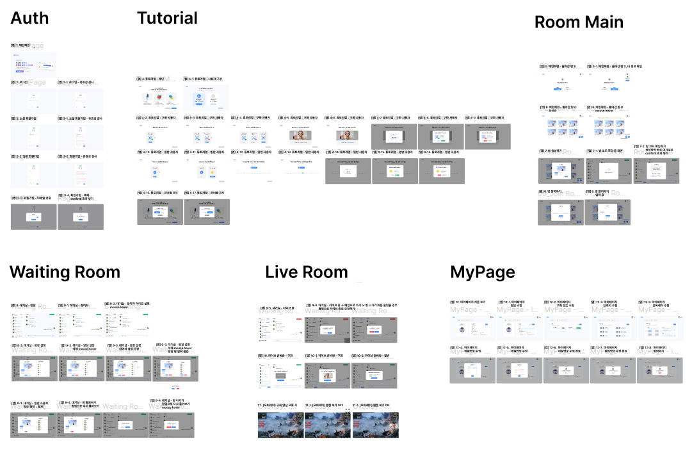
</div>

<h3>🗄️ ERD</h3>
<div align="center">

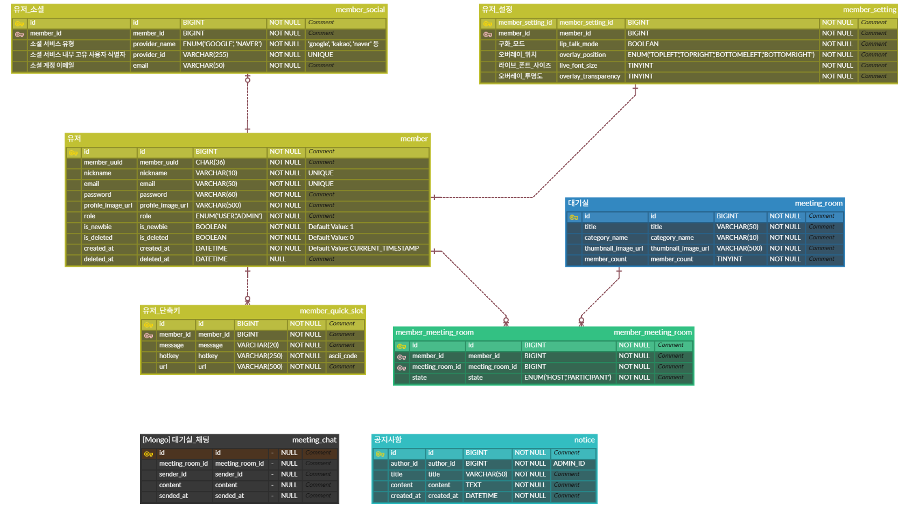
</div>

<h3>✅ Swagger API Docs</h3>
<details align="left">
  <summary>
    <strong>자세히</strong>
  </summary>

  <div align="center">

  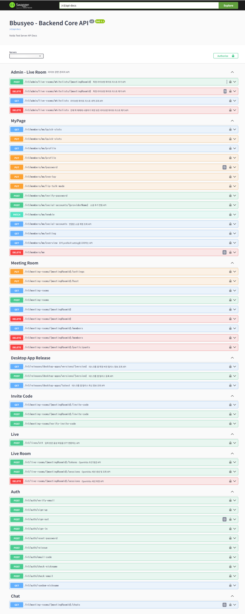
  </div>
</details>

<h3>📅 Jira Issues</h3>
<details align="left">
  <summary>
    <strong>자세히</strong>
  </summary>

  <div align="center">

  
  </div>
</details>

<h3><a href="https://www.notion.so/24276be4587d80a78d1ad824a9c825fe" target="_blank">📋 기능 명세서</a></h3>

<h3><a href="https://www.notion.so/API-22a76be4587d802cb7fed72fd1e93204" target="_blank">📡 API 명세서</a></h3>
